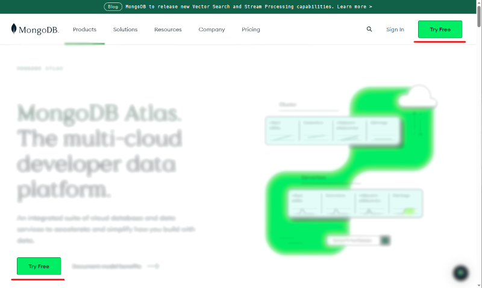
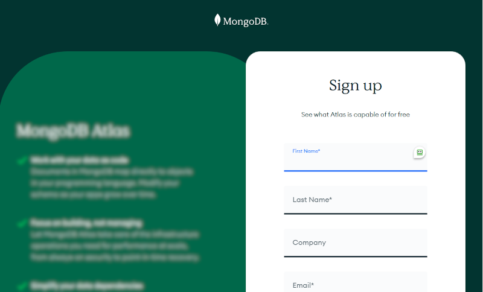
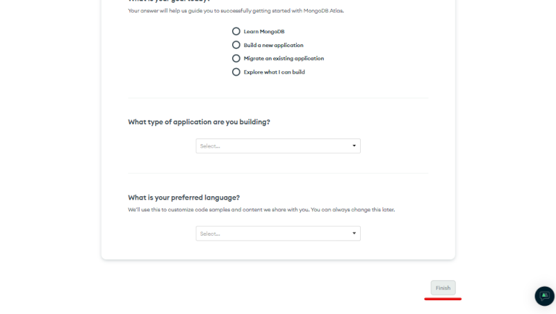
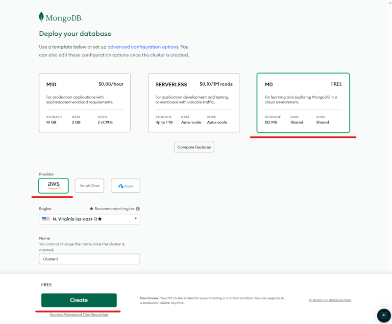
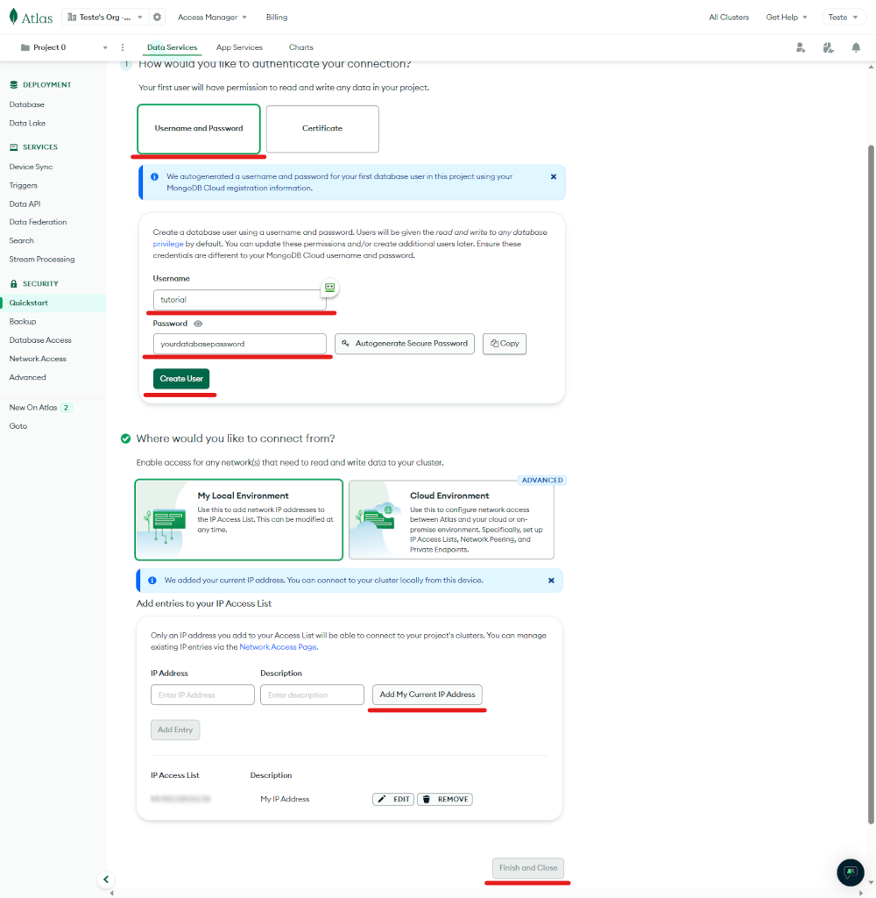
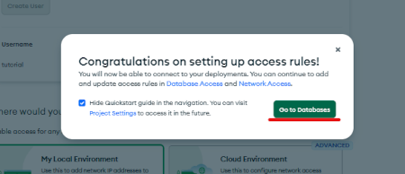
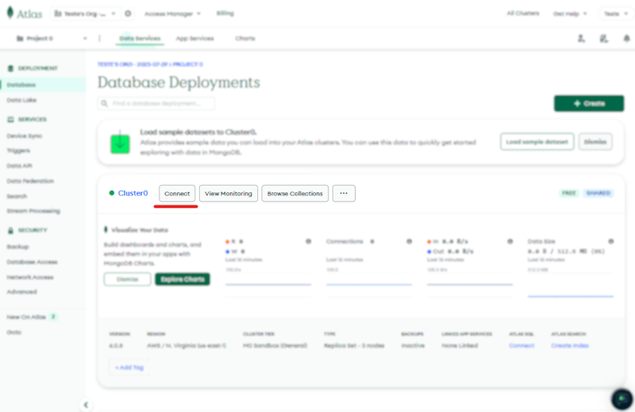
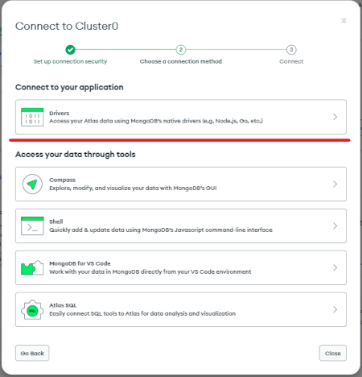
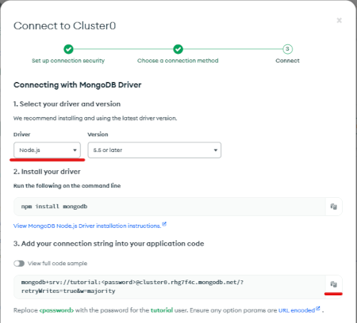

# Criando MondoDB Server on Atlas

> → ❕ **Tutorial atualizado em *29/07/2023***

1. Primeiro acesse a página oficial do MongoDB Atlas: [&lt;https://www.mongodb.com/atlas&gt;](https://www.mongodb.com/atlas), e clique em "Try Free"
  
1. Crie sua conta. (se já tiver uma, pule para [Já tenho conta](#já-tenho-conta))
  
1. Preencha os campos e clique em "Finish"
  
1. Selecione um plano e clique em "Create"
  
1. Clique em "Username and Password", preencha com um nome de usuário e uma senha (guarde ela), e clique em "Create User". Em seguida clique em "My Local Environment", se seu endereço de IP ainda não estiver na lista "IP Access List", clique em "Add My Current IP Address" e finalize em "Finish and Close".
  
1. Clique em "Go to Databases"
  
#### Já tenho conta
1. No seu cluster, clique em "Connect"

2. Clique em "Drivers"

3. Selecione "Node.js" e copie o template de URI

