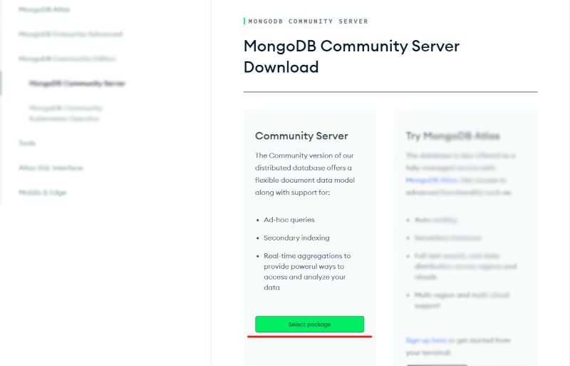
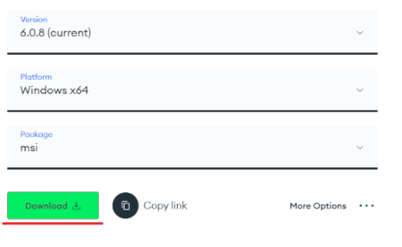
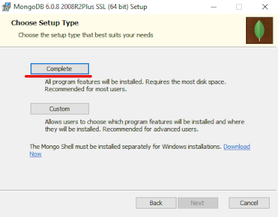
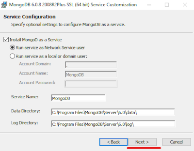
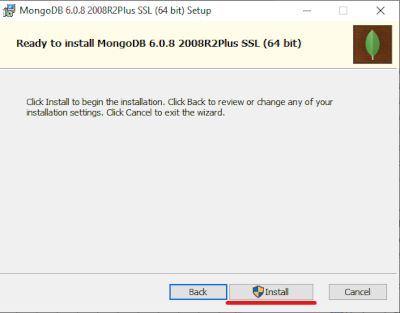
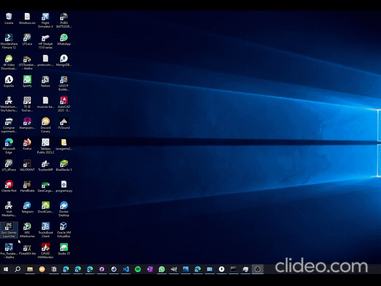

# Instalação do MongoDb Community localmente

> → ❕ **Tutorial atualizado em *29/07/2023***

1. Acesse o página de download do mongodb communnity: [&lt;https://www.mongodb.com/try/download/community&gt;](https://www.mongodb.com/try/download/community), e clique em "Select package"

2. Selecione seu sistema operacional, clique em "Download" e faça a instalação do mongodb

3. Faça a instaçao completa do mongodb



4. Depois de instalado, abra o seu prompt de comandos e execute o comando abaixo para garantir que seu servidor mongo já está rodando:

```bash
$ mongod
```

* **Caso o comando `mongod` não seja reconhecido, adicione a pasta `bin` encontrada no local de instalação do mongodb ao PATH*


5. Geralmente a URI padrão do mongodb local é: `mongodb://127.0.0.1:27017`
